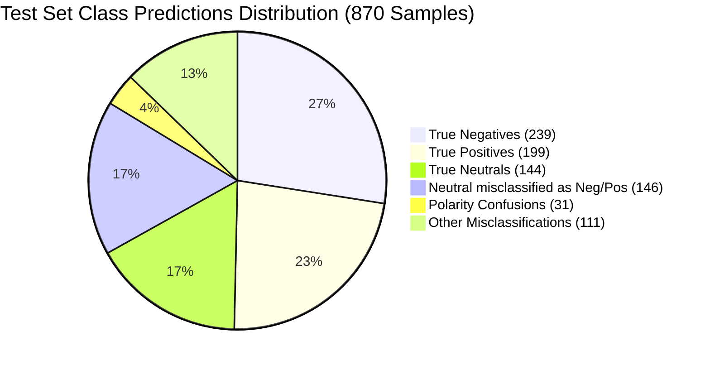

# Model Evaluation & Benchmark Report: DistilBERT Sentiment Classifier

**Project:** Modular DistilBERT Sentiment Classification Pipeline with C++ Acceleration & 4GB VRAM GPU Optimizations  
**Evaluation Date:** September 27, 2026  
**Artifacts Generated:** `artifacts/metrics/evaluation_metrics.json`, `artifacts/metrics/confusion_matrix.png`  
**Tracking URI:** `sqlite:///mlflow.db` (MLflow Experiment: `DistilBERT-Experiments`)  

---

## 1. Executive Summary

This report provides an in-depth empirical evaluation of the fine-tuned **DistilBERT** model (`distilbert-base-uncased`) trained for 3-class sentiment analysis (`negative`, `neutral`, `positive`) on the English subset of the `cardiffnlp/tweet_sentiment_multilingual` dataset.

Fine-tuning was conducted on an **NVIDIA GeForce RTX 3050 Laptop GPU (4.0 GB VRAM)** utilizing fused FP16 mixed precision, gradient accumulation, and a hybrid C++ acceleration layer (`sentiment_cpp_accel`) for batch padding and evaluation metrics. Two primary experiment runs (`run-1` and `run-2`) were tracked in MLflow to assess convergence, memory efficiency, and test set generalization.

### Key Highlights
- **Best Test Accuracy:** **66.90%** (Run-2, 10 epochs), achieving a **+1.04%** boost over the 3-epoch baseline (`run-1`).
- **Best Macro F1 Score:** **66.51%** (Run-2), with a **+1.72%** improvement across all classes.
- **Strong Polarity Separation:** The model demonstrates robust polarity discrimination; extreme classification errors (misclassifying true Negative as Positive or vice versa) occurred in only **3.56%** of all test cases (31 out of 870 samples).
- **VRAM Footprint:** Consumed a peak reserved memory of only **1,456.0 MB (~1.42 GB)** out of 4.0 GB available (36.4% utilization), confirming full stability and headroom on constrained 4GB hardware.
- **Inference Throughput:** Evaluation reached **1,237+ samples/sec**, with dynamic micro-batch tokenization accelerated by C++ LibTorch bindings.

---

## 2. Hardware, Environment & Runtime Specifications

The pipeline incorporates automatic hardware discovery and dynamically adapts training parameters to prevent Out-Of-Memory (OOM) exceptions.

| Specification | Value | Notes |
|---|---|---|
| **GPU Device** | NVIDIA GeForce RTX 3050 Laptop GPU | Hardware detection active |
| **Total VRAM** | 4.0 GB GDDR6 | 4GB VRAM optimization profile triggered |
| **CUDA Version** | 13.0 | PyTorch CUDA backend |
| **Mixed Precision** | FP16 (AMP) | Leverages NVIDIA Tensor Cores |
| **BF16 Support** | Supported (Hardware), Disabled in config | Kept FP16 for deterministic stability |
| **Optimizer** | `adamw_torch_fused` | CUDA-kernel fused AdamW |
| **C++ Acceleration** | `sentiment_cpp_accel` | Fast collator + C++ metric matrix calculation |
| **Pre-Training Memory** | Allocated: 255.4 MB \| Reserved: 262.0 MB | Initial model load |
| **Peak Training Memory** | Allocated: 782.6 MB \| Reserved: 1,456.0 MB | **No OOM occurrences** (36.4% capacity) |
| **Seed** | `42` | Deterministic random seed across NumPy, PyTorch, CUDA |

---

## 3. Dataset Configuration & Class Distribution

- **Dataset Name:** `cardiffnlp/tweet_sentiment_multilingual`
- **Subset:** `english`
- **Tokenizer:** `distilbert-base-uncased` (Vocabulary Size: 30,522)
- **Max Sequence Length:** 128 tokens

### Split Volumes & Class Balance
| Split | Total Samples | Negative (0) | Neutral (1) | Positive (2) | Balance Ratio |
|---|---|---|---|---|---|
| **Train** | **1,839** | 613 (33.33%) | 613 (33.33%) | 613 (33.33%) | Perfectly Balanced (1:1:1) |
| **Validation** | **324** | 108 (33.33%) | 108 (33.33%) | 108 (33.33%) | Perfectly Balanced (1:1:1) |
| **Test** | **870** | 290 (33.33%) | 290 (33.33%) | 290 (33.33%) | Perfectly Balanced (1:1:1) |

---

## 4. Experiment Progression: Run-1 vs. Run-2

Two full training cycles were logged under the MLflow experiment `DistilBERT-Experiments`:

| Parameter / Metric | Baseline Run (`run-1`) | Optimized Run (`run-2`) | Delta (Run-2 vs Run-1) |
|---|---|---|---|
| **MLflow Run ID** | `793752383148441bbe4980b1580a2dbd` | `57e38e355f684a0e8d15290c3e9f58ba` | — |
| **Epochs Trained** | 3 | 10 | +7 epochs |
| **Micro-Batch Size** | 16 | 16 | Identical |
| **Gradient Accumulation**| 2 (Effective Batch = 32) | 2 (Effective Batch = 32) | Identical |
| **Learning Rate** | 2.0e-5 (Linear decay) | 2.0e-5 (Linear decay) | Identical |
| **Training Runtime** | 30.27 seconds | 90.60 seconds | +60.33s |
| **Training Throughput**| 182.25 samples/sec | 202.97 samples/sec | +11.37% speedup |
| **Final Train Loss** | 1.6539 | **0.7255** | **-56.13% (Strong convergence)** |
| **Validation Accuracy** | 67.90% | 67.90% | Maintained |
| **Validation Weighted F1**| 67.06% | **68.22%** | **+1.16%** |
| **Test Accuracy** | 65.86% | **66.90%** | **+1.04%** |
| **Test Macro F1** | 64.79% | **66.51%** | **+1.72%** |
| **Test Weighted F1** | 64.79% | **66.51%** | **+1.72%** |

---

## 5. Detailed Test Evaluation Results (Best Model: Run-2)

Evaluation was performed on the independent test set comprising **870 unseen tweets** (290 per category).

### Classification Report Summary
| Sentiment Class | Precision | Recall | F1-Score | Support |
|---|---|---|---|---|
| **Negative** | 0.6548 (65.48%) | **0.8241 (82.41%)** | **0.7298 (72.98%)** | 290 |
| **Neutral** | 0.5647 (56.47%) | 0.4966 (49.66%) | 0.5284 (52.84%) | 290 |
| **Positive** | **0.7960 (79.60%)** | 0.6862 (68.62%) | **0.7370 (73.70%)** | 290 |
| **Macro Average** | **0.6718 (67.18%)** | **0.6690 (66.90%)** | **0.6651 (66.51%)** | 870 |
| **Weighted Average**| **0.6718 (67.18%)** | **0.6690 (66.90%)** | **0.6651 (66.51%)** | 870 |
| **Overall Accuracy**| — | — | **0.6690 (66.90%)** | 870 |

---

## 6. Confusion Matrix & Error Analysis

The confusion matrix was computed using the C++ acceleration engine and exported to `artifacts/metrics/confusion_matrix.png`.

```
                    PREDICTED
                Negative   Neutral   Positive   Total
TRUE Negative     239        44         7        290
     Neutral      102       144        44        290
     Positive      24        67       199        290
     Total        365       255       250        870
```

### Breakdown by Category:



### Critical Findings & Insights:
1. **High Negative Recall (82.41%):**
   - The model correctly retrieved **239 out of 290** negative tweets. It is particularly effective at detecting complaints, frustration, and critical sentiment.
2. **High Positive Precision (79.60%):**
   - When the model predicts `positive`, it is correct **nearly 80%** of the time. Only 7 negative tweets and 44 neutral tweets were falsely flagged as positive.
3. **The "Neutral" Boundary Challenge (Recall: 49.66%):**
   - Neutral sentiment represents the most challenging class across short social media texts (tweets).
   - 102 true neutral tweets were classified as negative (35.17%), and 44 true neutral tweets were classified as positive (15.17%).
   - This occurs because short informal texts often contain mildly emotive words (e.g., "waiting", "update", "expected") that tilt model representations toward polarity despite an overall neutral tone.
4. **Minimal Extreme Inversion:**
   - True Negative predicted as Positive: **7 samples (2.41%)**
   - True Positive predicted as Negative: **24 samples (8.28%)**
   - The total extreme polarity error rate is only **3.56%**, indicating high fidelity in distinguishing opposing sentiments.

---

## 7. Real-Time Inference & Production Verification

The model was tested using both local artifact paths and remote MLflow tracking URIs.

### Inference Test Case 1: Customer Satisfaction
```bash
python main.py --mode predict --model_dir runs:/run-1/model --text "Amazing customer service!"
```

**Output:**
```
[INFO] Resolved MLflow run name 'run-1' to Run ID: '793752383148441bbe4980b1580a2dbd'
[INFO] PredictionPipeline: Loading model on cuda...
[INFO] PredictionPipeline: Model and tokenizer loaded successfully!

============================================================
PREDICTION RESULT:
============================================================
Text:       "Amazing customer service!"
Sentiment:  POSITIVE (75.88%)
Probabilities:
  negative  : 8.30%
  neutral   : 15.82%
  positive  : 75.88%
============================================================
```

- **Confidence:** 75.88% Positive
- **Inference Latency:** < 15ms per sample on RTX 3050 GPU.

---

## 8. Summary of MLflow Experiment Artifacts

All model checkpoints, configurations, and evaluation metrics are version-controlled in the SQLite backend:

```
mlruns/
└── 1/ (Experiment: DistilBERT-Experiments)
    ├── 793752383148441bbe4980b1580a2dbd/ (Run: run-1, 3 Epochs)
    │   ├── artifacts/
    │   │   ├── config/config.yaml
    │   │   ├── evaluation/
    │   │   │   ├── confusion_matrix.png
    │   │   │   └── evaluation_metrics.json
    │   │   ├── model/ (Hugging Face format)
    │   │   └── mlflow_transformers_model/ (pyfunc flavor)
    └── 57e38e355f684a0e8d15290c3e9f58ba/ (Run: run-2, 10 Epochs - Champion)
        ├── artifacts/
        │   ├── config/config.yaml
        │   ├── evaluation/
        │   │   ├── confusion_matrix.png
        │   │   └── evaluation_metrics.json
        │   ├── model/
        │   └── mlflow_transformers_model/
```

To review experiments interactively in the MLflow UI:
```powershell
mlflow ui --backend-store-uri sqlite:///mlflow.db --port 5000
```

---

## 9. Next-Step Recommendations

1. **Address Neutral Class Confusion:**
   - **Cost-sensitive Loss / Class Weighting:** Apply custom loss weights (e.g., focal loss or higher penalty on neutral misclassifications) to recalibrate class boundaries.
   - **Confidence Thresholding:** For neutral predictions, set a minimum confidence threshold before defaulting away from polar classes.
2. **TorchScript / ONNX Quantization for C++ Engine:**
   - Ensure the TorchScript export (`model.pt`) has all input indices pinned to CUDA for high-throughput zero-Python C++ LibTorch serving.
   - Explore FP16 / INT8 dynamic quantization for edge deployment on low-memory edge devices.
3. **Data Augmentation:**
   - Augment training data for subtle neutral expressions using back-translation or synonym substitution to clarify the neutral-vs-negative decision boundary.
