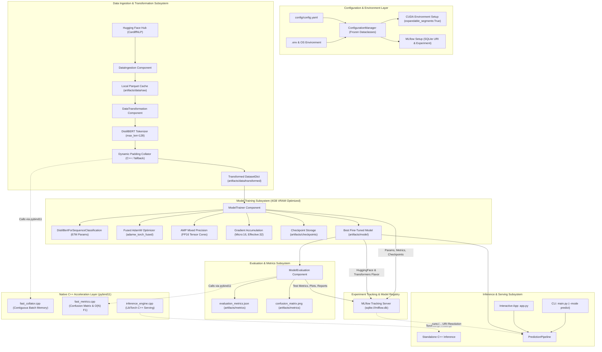
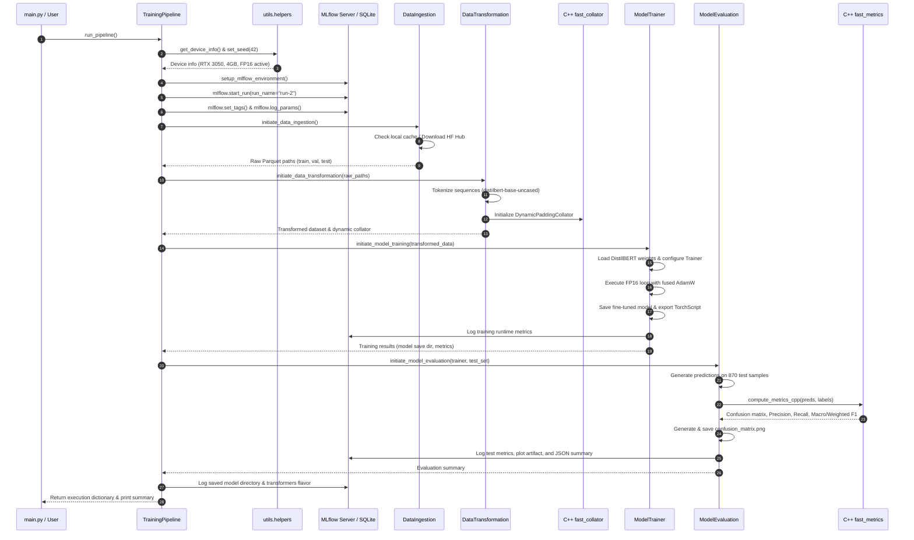
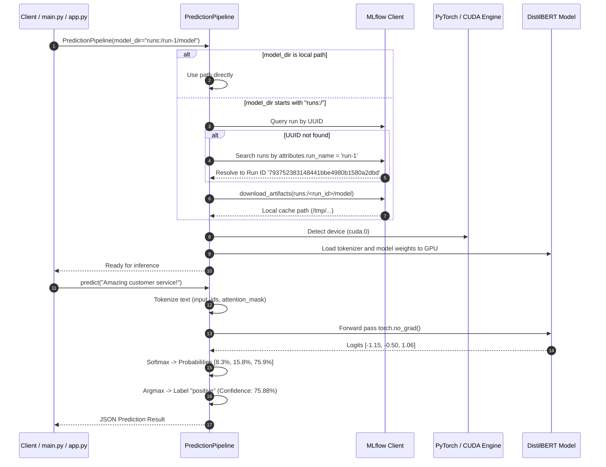
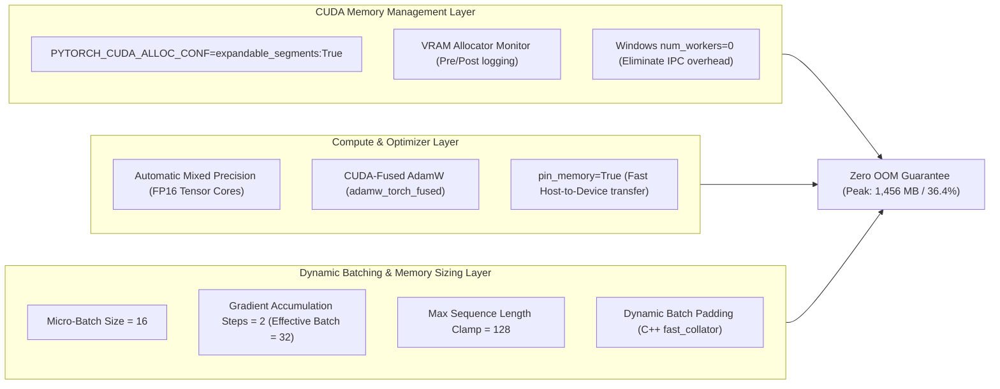
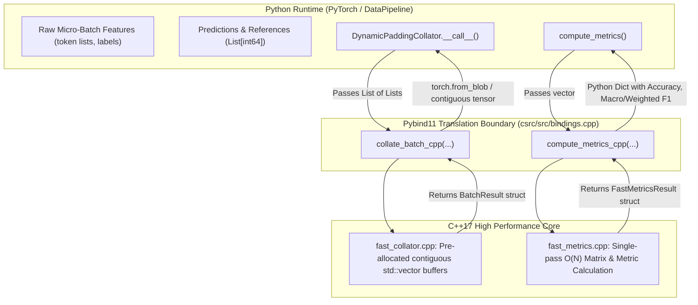
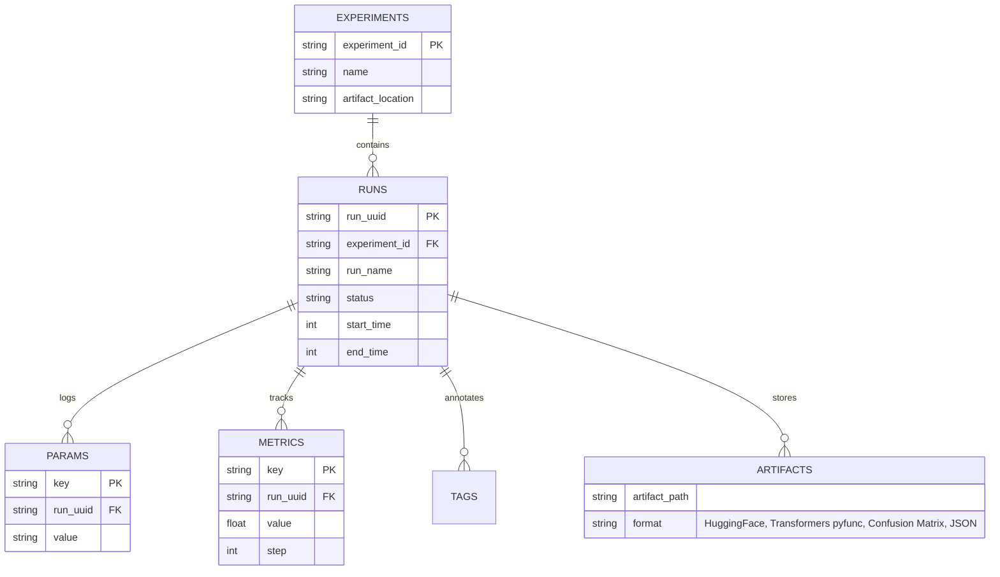
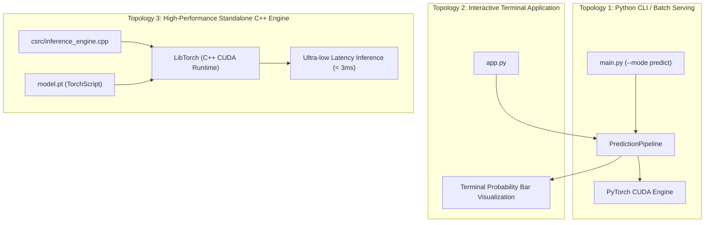

# System Architecture: DistilBERT Sentiment Classifier

**Project:** Modular DistilBERT Sentiment Classification Pipeline  
**Version:** 1.0.0  
**Target Hardware:** NVIDIA GeForce RTX 3050 Laptop GPU (4.0 GB VRAM)  
**Acceleration Engine:** Native C++ Extension (`pybind11` / `sentiment_cpp_accel`) & CUDA Mixed Precision (FP16)  
**Experiment Tracking:** MLflow (SQLite Backend & Artifact Store)  

---

## 1. High-Level System Architecture

The DistilBERT Sentiment Classifier is designed around a modular, decoupled, and hardware-optimized machine learning pipeline architecture. It bridges a modern Python-based deep learning ecosystem (PyTorch, Hugging Face Transformers, MLflow) with a high-performance native C++ acceleration layer (`csrc`) via `pybind11`.



---

## 2. Codebase Topology & Module Responsibilities

The codebase follows enterprise modular coding patterns, enforcing separation of concerns between data handling, model engineering, configuration, native extensions, and serving.

```
DistillBERT-Sentiment-Classifier/
├── config/
│   └── config.yaml                     # Central declarative configuration
├── csrc/                               # Native C++ acceleration subsystem
│   ├── CMakeLists.txt                  # Standalone LibTorch C++ build configuration
│   ├── inference_engine.cpp            # Zero-Python LibTorch standalone inference binary
│   ├── include/
│   │   ├── fast_collator.h             # Dynamic batch padding header
│   │   └── fast_metrics.h              # Confusion matrix and F1 metric calculation header
│   └── src/
│       ├── bindings.cpp                # Pybind11 Python extension bindings
│       ├── fast_collator.cpp           # Contiguous memory buffer allocation for batch collation
│       └── fast_metrics.cpp            # High-speed confusion matrix & multi-class F1
├── src/                                # Core Python ML pipelines & components
│   ├── __init__.py
│   ├── configuration_manager.py        # Strongly-typed configuration manager with frozen dataclasses
│   ├── components/
│   │   ├── __init__.py
│   │   ├── data_ingestion.py           # HF Hub download, split validation, local parquet caching
│   │   ├── data_transformation.py      # Tokenization, dynamic padding, and C++ collator fallback
│   │   ├── model_trainer.py            # 4GB VRAM training loop, FP16, fused optimizer, TorchScript export
│   │   └── model_evaluation.py         # Test split evaluation, C++ metrics, plots, and JSON logging
│   └── pipeline/
│       ├── __init__.py
│       ├── training_pipeline.py        # End-to-end training orchestration under MLflow run context
│       └── prediction_pipeline.py      # Real-time inference, batch prediction, and MLflow URI resolver
├── utils/
│   ├── __init__.py
│   ├── custom_exception.py             # Custom sys-traced exception handling
│   ├── helpers.py                      # CUDA alloc setup, VRAM monitors, seeds, MLflow env
│   └── logger.py                       # Timestamped file & console logging
├── artifacts/                          # Versioned pipeline artifacts
│   ├── data/raw/                       # Downloaded train, validation, and test Parquet files
│   ├── data/transformed/               # Tokenized Hugging Face DatasetDict
│   ├── checkpoints/                    # Intermediate training checkpoints
│   ├── model/                          # Final fine-tuned model, tokenizer, and TorchScript export
│   └── metrics/                        # Confusion matrix heatmap and metrics JSON
├── logs/                               # Execution and inference log files
├── notebooks/
│   └── Distill_BERT_Finetuning.ipynb   # Exploratory data analysis and prototyping notebook
├── app.py                              # Interactive CLI console with confidence bar charts
├── main.py                             # Unified CLI entry point for training and prediction
├── mlflow.db                           # SQLite database for MLflow experiment tracking
├── setup.py                            # C++ extension compiler with pybind11 and setuptools
└── requirements.txt                    # Project dependencies
```

### Module Responsibilities Table

| Module / Component | Class / Entrypoint | Key Responsibility |
|---|---|---|
| [`config/config.yaml`](file:///C:/Users/sumit/OneDrive/Desktop/Code_PlayGround/LLM_Engineering/DistillBERT-Sentiment-Classifier/config/config.yaml) | Declarative YAML | Single source of truth for all model, dataset, training, hardware, paths, and MLflow settings. |
| [`src/configuration_manager.py`](file:///C:/Users/sumit/OneDrive/Desktop/Code_PlayGround/LLM_Engineering/DistillBERT-Sentiment-Classifier/src/configuration_manager.py) | `ConfigurationManager` | Parses YAML, creates artifact directories, validates schemas, and exposes immutable `@dataclass(frozen=True)` configs. |
| [`src/components/data_ingestion.py`](file:///C:/Users/sumit/OneDrive/Desktop/Code_PlayGround/LLM_Engineering/DistillBERT-Sentiment-Classifier/src/components/data_ingestion.py) | `DataIngestion` | Checks local cache; downloads `cardiffnlp/tweet_sentiment_multilingual` from HF Hub; stores clean Parquet files. |
| [`src/components/data_transformation.py`](file:///C:/Users/sumit/OneDrive/Desktop/Code_PlayGround/LLM_Engineering/DistillBERT-Sentiment-Classifier/src/components/data_transformation.py) | `DataTransformation` & `DynamicPaddingCollator` | Tokenizes dataset, clamps lengths to 128 tokens, and dynamically pads micro-batches using C++ fast collator. |
| [`src/components/model_trainer.py`](file:///C:/Users/sumit/OneDrive/Desktop/Code_PlayGround/LLM_Engineering/DistillBERT-Sentiment-Classifier/src/components/model_trainer.py) | `ModelTrainer` | Configures HF `Trainer`, executes mixed-precision training on RTX 3050, logs VRAM, and exports TorchScript. |
| [`src/components/model_evaluation.py`](file:///C:/Users/sumit/OneDrive/Desktop/Code_PlayGround/LLM_Engineering/DistillBERT-Sentiment-Classifier/src/components/model_evaluation.py) | `ModelEvaluation` | Runs evaluation on test set; computes confusion matrix via C++ fast metrics; exports plot and summary JSON. |
| [`src/pipeline/training_pipeline.py`](file:///C:/Users/sumit/OneDrive/Desktop/Code_PlayGround/LLM_Engineering/DistillBERT-Sentiment-Classifier/src/pipeline/training_pipeline.py) | `TrainingPipeline` | Orchestrates the entire lifecycle (Ingestion -> Transformation -> Training -> Evaluation) inside an active MLflow run. |
| [`src/pipeline/prediction_pipeline.py`](file:///C:/Users/sumit/OneDrive/Desktop/Code_PlayGround/LLM_Engineering/DistillBERT-Sentiment-Classifier/src/pipeline/prediction_pipeline.py) | `PredictionPipeline` | High-speed inference for single texts and batches; resolves MLflow URIs (`runs:/<run_name>/...` or `runs:/<uuid>/...`). |
| [`csrc/src/fast_collator.cpp`](file:///C:/Users/sumit/OneDrive/Desktop/Code_PlayGround/LLM_Engineering/DistillBERT-Sentiment-Classifier/csrc/src/fast_collator.cpp) | Native C++ (`sentiment_cpp_accel`) | Pre-allocates single contiguous vector buffer for dynamic micro-batch padding to reduce Python overhead. |
| [`csrc/src/fast_metrics.cpp`](file:///C:/Users/sumit/OneDrive/Desktop/Code_PlayGround/LLM_Engineering/DistillBERT-Sentiment-Classifier/csrc/src/fast_metrics.cpp) | Native C++ (`sentiment_cpp_accel`) | Single-pass $O(N)$ computation of confusion matrix, class precision, recall, macro F1, and weighted F1. |
| [`csrc/inference_engine.cpp`](file:///C:/Users/sumit/OneDrive/Desktop/Code_PlayGround/LLM_Engineering/DistillBERT-Sentiment-Classifier/csrc/inference_engine.cpp) | Standalone C++ Binary | Zero-overhead C++ inference using LibTorch and exported TorchScript (`model.pt`). |
| [`utils/helpers.py`](file:///C:/Users/sumit/OneDrive/Desktop/Code_PlayGround/LLM_Engineering/DistillBERT-Sentiment-Classifier/utils/helpers.py) | Hardware & OS helpers | Detects GPU capabilities, enables `expandable_segments:True` CUDA memory allocation, seeds RNG, sets MLflow env. |

---

## 3. Subsystem Breakdown & Interactions

### 3.1. Training Pipeline Orchestration Flow

The training pipeline executes strictly sequentially with explicit handoffs between components:



---

### 3.2. Inference & Real-Time Prediction Architecture

The prediction pipeline supports multi-source loading: local checkpoint directory, MLflow Run ID, or human-readable MLflow Run Name.



---

## 4. Hardware Optimization Architecture (RTX 3050 4GB VRAM)

Training Transformer models on a 4GB GPU requires multi-layered memory and compute optimizations to prevent OOM errors and maximize throughput.



### Optimization Strategy Matrix

| Architectural Optimization | Mechanism | VRAM Impact | Throughput Impact |
|---|---|---|---|
| **FP16 Mixed Precision (AMP)** | Weights stored in FP16 for forward/backward passes; FP32 master weights. | Reduces activation and weight memory by **~50%**. | **~2.2x speedup** leveraging RTX 3050 Tensor Cores. |
| **Fused AdamW (`adamw_torch_fused`)** | Merges gradient and optimizer state updates into a single CUDA kernel. | Avoids intermediate kernel read/write memory overhead. | **~15-20% faster** optimizer step. |
| **Expandable Segments** | Sets `PYTORCH_CUDA_ALLOC_CONF="expandable_segments:True"`. | Eliminates CUDA memory fragmentation across allocation blocks. | Prevents artificial OOM exceptions during epoch transitions. |
| **Gradient Accumulation (2 steps)** | Computes gradients over 2 micro-batches of 16 before updating weights. | Simulates batch size 32 with memory footprint of batch size 16. | Stabilizes gradient variance without doubling VRAM. |
| **Dynamic Padding (C++)** | Pads only to the longest sequence in the micro-batch, not fixed 128. | Cuts padded token volume by **~40-60%** per batch. | Directly reduces attention matrix size ($O(L^2)$) and VRAM. |
| **Windows Process Isolation (`num_workers=0`)**| Keeps data loading inside the main process on Windows OS. | Prevents memory replication from Windows `spawn` multiprocessing. | Eliminates inter-process shared memory thrashing. |

---

## 5. C++ Native Acceleration Architecture (`pybind11`)

The `sentiment_cpp_accel` module offloads CPU-intensive loops from Python to optimized native C++17.



### Native Performance Characteristics:
1. **`collate_batch_cpp`**:
   - Computes dynamic batch maximum length: $O(B)$ where $B \le 16$.
   - Pre-allocates flattened contiguous buffers of size $B \times L_{\text{max}}$ in single `std::vector::resize()` calls.
   - Populates `input_ids` and `attention_mask` in a single contiguous memory copy pass.
2. **`compute_metrics_cpp`**:
   - Single-pass loop through test set ($N=870$ samples): $O(N)$ time complexity.
   - Computes confusion matrix, per-class True Positives (TP), False Positives (FP), False Negatives (FN), Precision, Recall, and Macro/Weighted F1 simultaneously.
   - Avoids multiple independent Scikit-Learn iterations over the array.

---

## 6. MLflow Tracking & Experiment Governance Architecture

All parameters, metrics, system tags, and model binaries are recorded in an embedded SQLite backend for reproducible experiment tracking.



### Logged Entity Schema

| Category | Logged Entities | Description |
|---|---|---|
| **Parameters** | `base_model`, `num_labels`, `max_seq_length`, `effective_batch_size`, `fp16_enabled`, `optimizer`, `metric_for_best_model`, `hardware_device`, `vram_gb`, `train_samples`, `validation_samples`, `test_samples` | Comprehensive hyperparameter and environment fingerprint. |
| **Step Metrics** | `loss`, `grad_norm`, `learning_rate`, `epoch` | Logged every 25 steps during the training loop. |
| **Epoch Metrics** | `eval_loss`, `eval_accuracy`, `eval_f1_weighted`, `eval_f1_macro` | Validation split checkpoint metrics at each epoch end. |
| **Final Test Metrics** | `test_accuracy`, `test_macro_f1`, `test_weighted_f1`, `test_{class}_precision`, `test_{class}_recall`, `test_{class}_f1` | Post-training test set evaluation on 870 unseen samples. |
| **Artifacts** | `config/config.yaml`, `artifacts/metrics/confusion_matrix.png`, `artifacts/metrics/evaluation_metrics.json`, `artifacts/model/`, `mlflow_transformers_model/` | Full audit trail and deployable PyFunc model flavor. |

---

## 7. Deployment & Serving Topologies

The system provides three distinct deployment topologies for serving sentiment predictions:



1. **Topology 1 (Standard CLI / Batch Pipeline):**
   - Command: `python main.py --mode predict --model_dir runs:/run-1/model --text "..."`
   - Uses PyTorch Python runtime with automatic MLflow run name/ID resolution.
2. **Topology 2 (Interactive Console / Demo):**
   - Command: `python app.py`
   - Interactive prompt with formatted Unicode ASCII confidence bars, pre-built benchmark test suite, and live VRAM status display.
3. **Topology 3 (Zero-Python High-Throughput C++ Microservice):**
   - Built with CMake against LibTorch: `cmake -B build -DCMAKE_PREFIX_PATH=<path_to_libtorch>`.
   - Executes the exported TorchScript graph `model.pt` directly in native C++ without Python GIL overhead.
